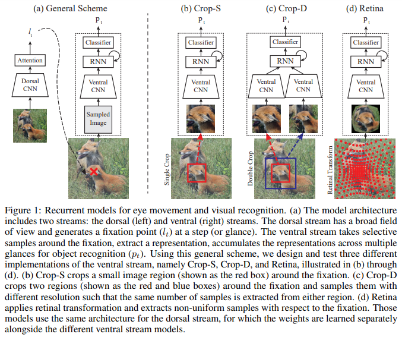
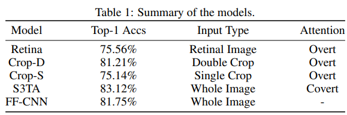
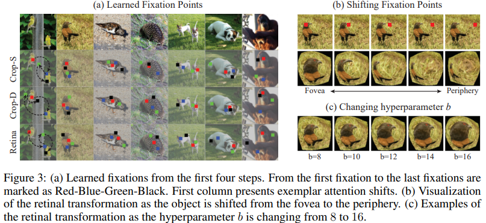
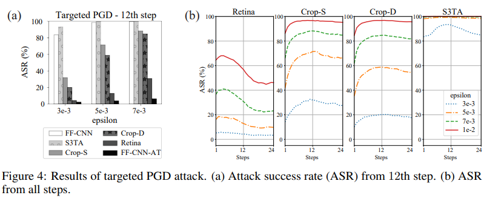
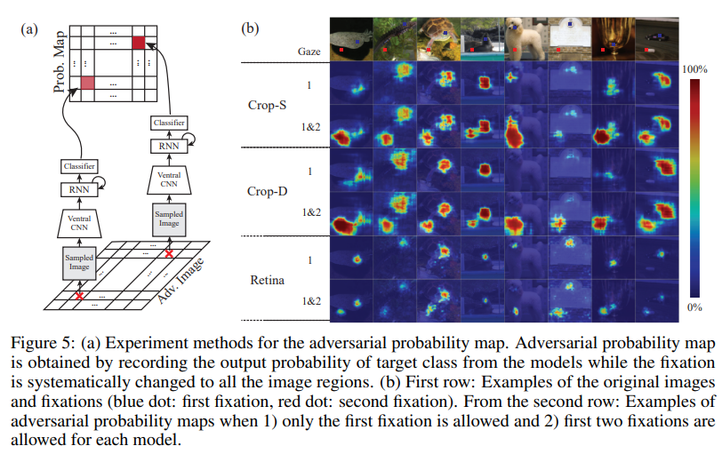

# Human Eyes Inspired Recurrent Neural Networks are More Robust Against Adversarial Noises
This repository contains the implementation and pre-trained models for the paper 
- ['Human Eyes Inspired Recurrent Neural Networks are More Robust Against Adversarial Noises'](https://drive.google.com/file/d/15G26FZpMKsM-IX7StENcOTOuVsd4ICRO/view?usp=sharing). 

Full code and data will be available soon. 

## Introduction

    

One of the most distinguished features of human vision from modern CNNs is adversarial robustness. While humans seem to be not affected by adversarial images, CNNs are vulnerable to the adversarial attacks. In this work, we try to discover sources of human robustness and improve machine vision's robustness by focusing on 1) eye movements and 2) retinal sampling found in the visual systems of primates. 

Primates actively search for informative regions in the scene, while CNNs process all the image regions. Inspired by primate eye movements, we propose a framework that explores images by sequentially attending different regions of images based on the two-stream hypothesis (Fig.1 (a)). There are two streams in the model, and their roles are distinct. The dorsal stream produces attention to guide its eyes, and the ventral stream recognizes objects based on the current attentional focus. 
We devise and test three different front-end of the model (corresponding to the eyes of primates), single-crop (Fig1.(b)), double-crop (Fig1.(c)), and retinal transformation (Fig1.(d)).

    

This figure illustrates how the resulting retinal transformation looks like based on the corresponding fixation locations. 

### Contributions
- Devised and tested three recurrent attention models with distinct sampling methods.  
- Tested various recurrent attention models against adversarial attacks, and checked their robustness during the recurrent process. 
- Demonstrated that the retinal transformation with eye movements achieved highest robustness in general, and it has an ability to recover its recognition during the attack as more eye gazes are deployed. 

## Results
To investigate the effects of each design choice on adversarial robustness, baseline models are carefully chosen (Table 1). 

    

The learned attention behavior are shown in Fig.3 (a), and the effect of the retinal transformation is shown in Fig.3 (b)&(c). 

    

Fig.4 shows that the retinal transformation with eye movements achieves highest robustness. At the same time, the model with the retinal transformation recovers its recognition performance by deploying more gazes. 

    

To investigate the robustness of the retinal transformation, adversarial vurnerability map is visualized in Fig.5. Fig.5 shows that the adversarial noises from the distinct time steps can be accumulated in the single-crop and double-crop models. However, in case of the model with retinal transformation, adversarial noise from the distinct time steps mitigate each other, which means the adversarial noises from the previous gazes become less effective in the fixation is located in the novel locations in the future. 

    

## ToDo
- Upload code and pre-trained data
