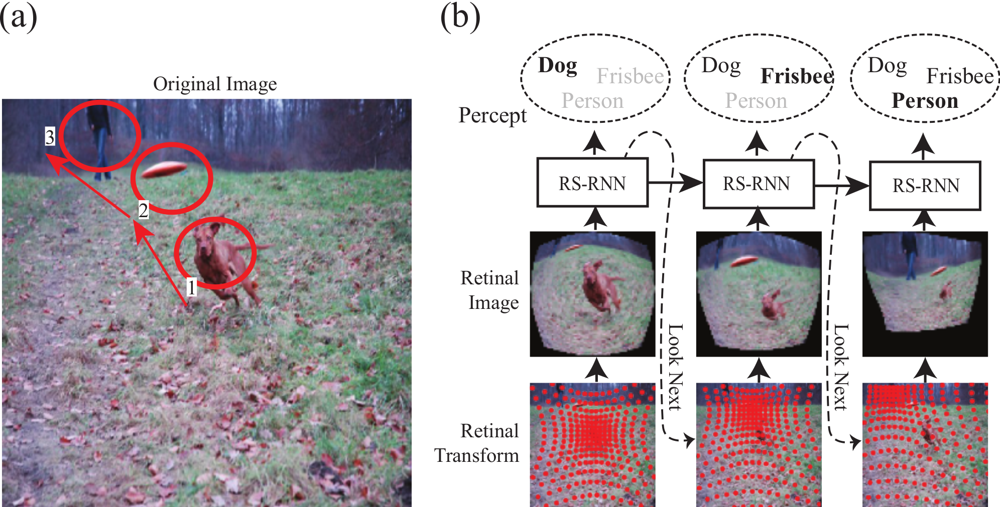
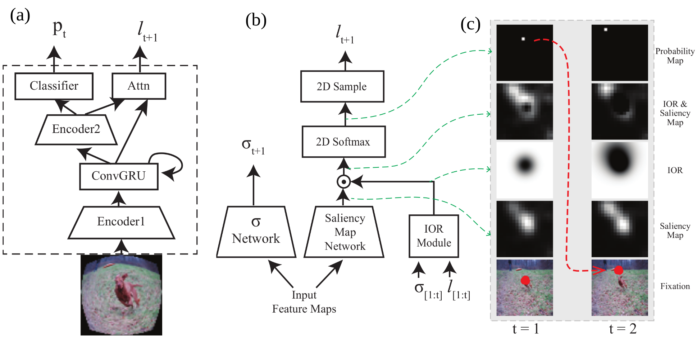
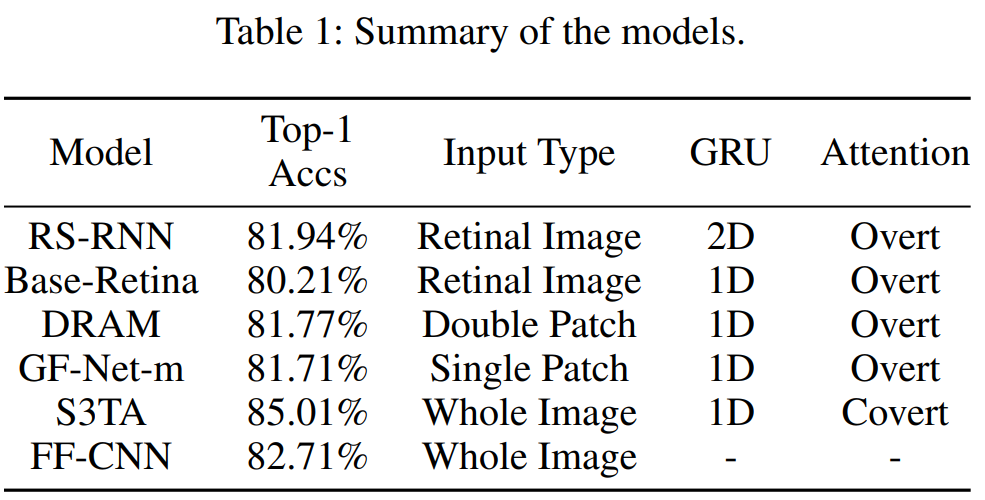
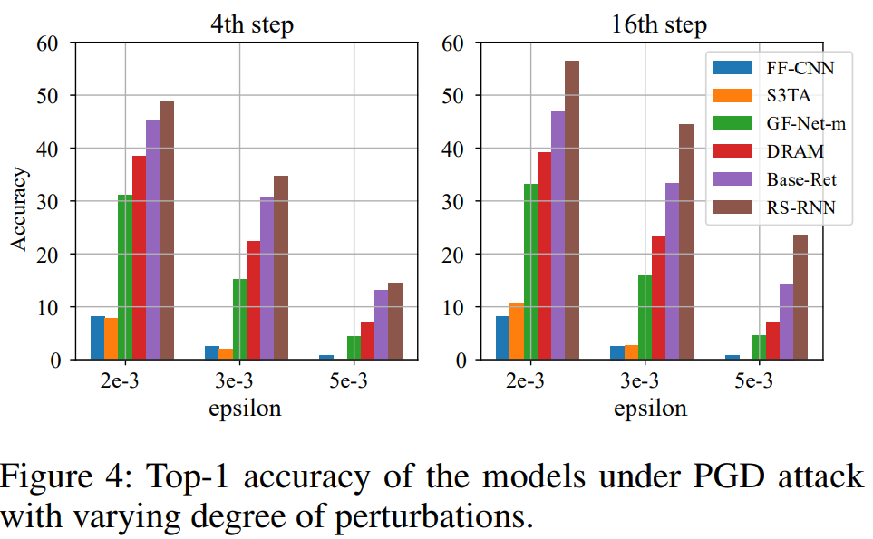
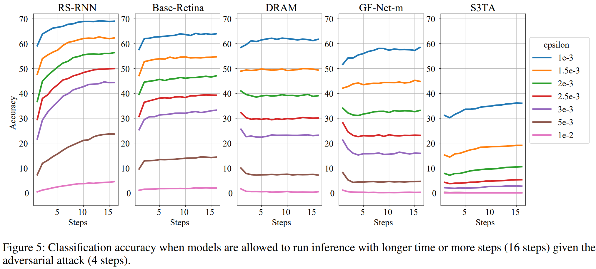
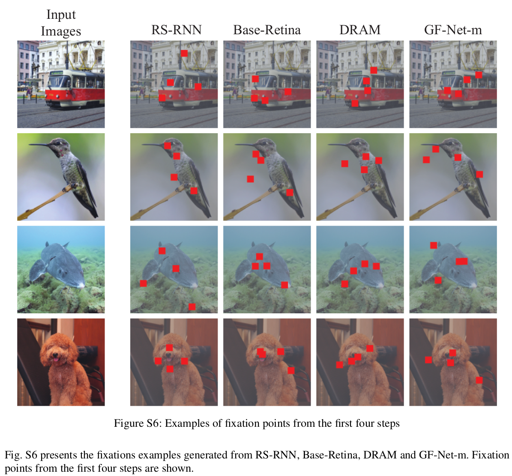
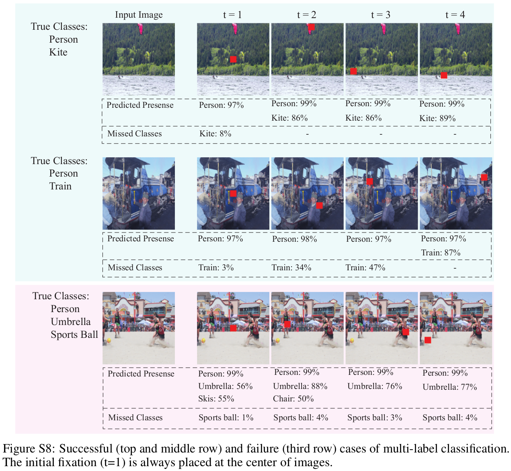

# RS-RNN in Pytorch (Submitted to AAAI-22, Under review)
This repository contains the official implementation and pre-trained models for the retinal sampling recurrent neural network (RS-RNN). 
- ['Retinal Transformation and Recurrent Attention Improve Adversarial Robustness'](https://drive.google.com/file/d/15G26FZpMKsM-IX7StENcOTOuVsd4ICRO/view?usp=sharing). 

Full code and data will be available soon. 

## Introduction
<p align="center">
    
</p>

One of the most distinguished features of human vision from modern CNNs is adversarial robustness. While humans seem to be not affected by adversarial images, CNNs are vulnerable to the adversarial attacks. In this work, we try to discover sources of human robustness and improve machine vision's robustness by focusing on 1) eye movements and 2) retinal sampling found in the visual systems of primates. 

Primates actively search for informative regions in the scene, while CNNs process all the image regions. Inspired by primate eye movements, we propose a novel framework that explores images by sequentially attending different regions of images (Figure a). 
However, eye movement is not merely for choosing a region to crop. Instead, the primate retina addresses the center of focus, while suppressing the peripheral regions. Once a fixation point is determined, our proposed model first transforms an image into a retinal image and processes it (Figure b).

As an example, assume that the model sequentially attends to a dog, a Frisbee, and a person as shown in the figure. The retinal image corresponding to each object maintains the high resolution for the attended objects, but the rest of the regions are downsampled. At each time step, RS-RNN receives information from a certain region and builds accumulated representations of an image by recurrent networks. Based on the representations, RS-RNN recognizes objects in an image and determines a location to look next. 

<p align="center">
    
</p>
The above figure (a) illustrates the model architecture. The model consists of convolutional encoders and gated recurrent units to process images. The attention module is further illustrated in (b), and its internal representations are shown in (c). 


<p align="center">
    
</p>


### Contributions
- Proposed a novel recurrent attention model that improves its adversarial robustness with longer recurrent steps. 
- Tested various recurrent attention models against adversarial attacks, and checked their robustness during the recurrent process. 
- Demonstrated that 1) eye movement with retinal sampling, and 2) spatial recurrent processing improves adversarial robustness. 

## Results
To investigate the effects of each design choice on adversarial robustness, baseline models are carefully chosen (Table 1). 
<p align="center">
    
</p>

RS-RNN and baseline models are evaluated under adversarial attack (PGD). 

<p align="center">
    
</p>
Figure 4 presents recognition accuracy of the recurrent attention models under PGD attack from the 4th (Fig.3, left) and 16th (Fig.3, right) steps. Unlike other baseline models, RS-RNN corrects its recognition accuracy as more recurrent steps are deployed. 

<p align="center">
    
</p>
Figure 5 presents step-wise accuracy under PGD attack. Recognition accuracy from RS-RNN is improved as more fixations are considered. 

<p align="center">
    
</p>
Fixation points from the models are marked as red squares. The models are trained on ImageNet and the images shown in Fig.S6 are from ImageNet. 

<p align="center">
    
</p>
Fixations points generated by RS-RNN are presented when the model is trained on multi-label classification (MS-COCO). Although objects are small, fixation points are well generated on those small objects. 

## Requirements
- Python 3.7
- Pytorch 1.4.1
- Torchvision 0.4.2

## Evaluate Pre-Trained Models

``` 
python adv_attack.py --checkpoint_path PATH_TO_CHECKPOINTS --data_path PATH_TO_DATASET
```

## Train Models
For training RS-RNN, we used four 2080Ti.  
```
python train.py --data_path PATH_TO_DATASET --model MODEL_NAME
```

## ToDo
- Upload code and pre-trained data
